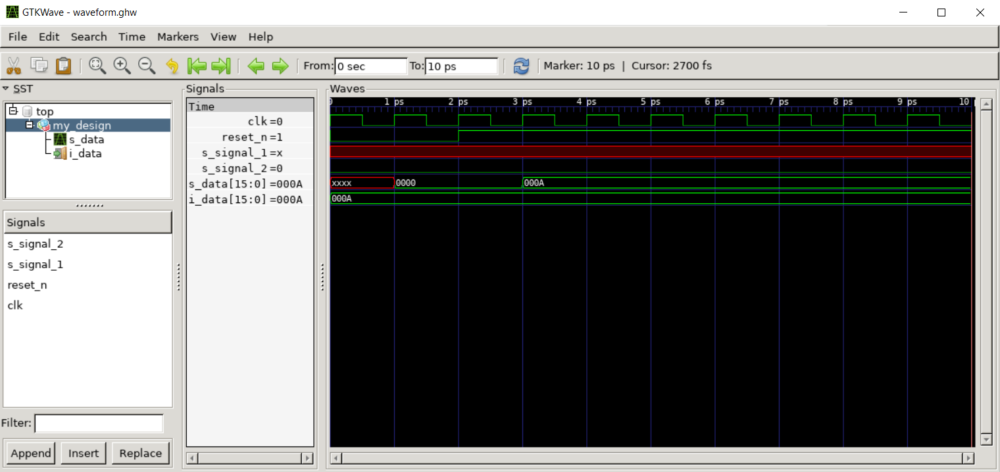

# Part 1 - The beginning

In this first part of the cocotb series we're going to get started with cocotb by creating a simple test bench to interact with a DUT and drive a couple of signals.

Note that this part will not walk you through how cocotb works under the hood or outline every basic aspect. As a primer, please have a look at these three pages from the official documentation to get a rough understanding of cocotb from a user perspective

- https://docs.cocotb.org/en/stable/quickstart.html 
- https://docs.cocotb.org/en/stable/writing_testbenches.html 
- https://docs.cocotb.org/en/v1.9.2/coroutines.html 

Don't worry if you don't grasp everything right away. This initial segment of the series touches on topics already covered in the official documentation. However, the upcoming chapters will diverge significantly, so building a fundamental understanding now will help you a lot as the code becomes more complex.

As stated in the official introduction to the series, the main purpose is educational. Numerous other setups (OS, simulators, tool versions…etc.) are possible. The one that was used here is based on the tools shown in the table below. Note that this list is incomplete as it only contains the most important pieces required at this point in time. Others are introduced in later chapters.

| Tool    | Version |
| -------- | ------- |
| Python | 3.8.10 |
| GNU Make |  4.2.1 |
| GCC | 9.4.0 |
| cocotb | 1.9.2 |
| ghdl | 5.0.0-dev |
| gtkwave | 3.3.103 |
| pytest | 8.3.4 |

## Objectives

- simple test bench to drive some signals
- single cocotb test
- parameterized tests with pytest
- Makefile and Python runner for test execution
- GHDL and gtkwave usage

## Step by step

| Source    | Description |
| -------- | ------- |
| my_design.vhd | DUT |
| test_my_design.py |  cocotb test bench file |
| test_runner.py |  Python runner. this file to execute simulation |
| Makefile |  GNU Makefile. Run this file to execute simulation |

The first thing to note is that there are two options to run test bench. Either via Makefile (original approach) or via python runner (new approach). As of cocotb version 1.9.2 python runners are still considered an experimental feature which is why you will see the following message on the console when using them.

> test_runner.py:4: UserWarning: Python runners and associated APIs are an experimental feature and subject to change. <br> from cocotb.runner import get_runner

This chapter of the cocotb series is the first and only one that has a Makefile. All others will just use a python runner. The reason is that we are more flexible with a python file especially regarding parameterized tests. It is also easier to execute additional code before running a test.

### DUT

Take a minute to look at the DUT in my_design.vhd. It is a relatively simple VHDL entity with 1 generic, 3 input ports (clock, reset and data) and 0 output ports. Two signals are purposely initialized to 'X' to confirm this value in the waveform viewer. The generic `G_DATA_WIDTH` will be target for parameterization as we commonly need to test a variety of valid generic values.

### Test bench

The file test_my_design.py contains the actual cocotb test that tests the DUT. A clock is started first. But since our design contains a synchronous `reset_n` signal we need to release the reset.

```python
async def run_reset_routine(dut):
    for _ in range(3):
        await RisingEdge(dut.clk)
    dut.reset_n.value = 1
    
...    

# Reset the module, wait 3 rising edges then release reset
cocotb.start_soon(run_reset_routine(dut))
```

Afterwards we instruct the test to wait on a **Trigger**, in this case a Timer for 10ns before continuing

```python
await Timer(10, units="ns")  # wait a bit
```

We could have also specified a different trigger, e.g. the next rising clock edge

```python
await RisingEdge(dut.clk)
```

or the next falling clock edge

```python
await FallingEdge(dut.clk)
```

> [!NOTE]
> Triggers are essential since they allow us to implement a "blocking" statement inside a co-routine which only resumes execution when the trigger is released

Lastly two assert statements are executed and the signal values are printed to the console.

### Makefile

Not too much magic going on in the Makefile to begin with. We tell it to use GHDL simulator and that the target language is VHDL.

```makefile
SIM ?= ghdl
TOPLEVEL_LANG ?= vhdl
```

However pay attention to these three lines

```makefile
RUN_ARGS = --std=08
SIM_ARGS = --wave=waveform.ghw
SIM_ARGS += -gG_DATA_WIDTH=16
```

> [!NOTE]
> Note that [GHDL crashes for --wave in some cases](https://github.com/ghdl/ghdl/issues/2640) hence sometimes --fst instead of --wave option must be used for waveform file generation
--wave Write the waveforms into a GHDL Waveform (GHW) file. Contrary to VCD files, any VHDL type can be dumped into a GHW file.
--fst This option specifies that GHDL should generate an FST (Fast Signal Trace) file. The fst files are much smaller than VCD or GHW files, but it handles only the same signals as the VCD format.

The first line instructs the simulator (in this case GHDL) to compile VHDL source files by applying the VHDL 2008 standard. The next two lines specify simulation arguments: write out a waveform file and set generic `G_DATA_WIDTH` to 16. Obviously more arguments could be added as needed.

The Makefile can be run via

```makefile
SIM=ghdl make
```

### Python runner

The content in the file test_runner.py is the equivalent to that in the Makefile with one exception, pytest parameterization. A list of possible values is specified for the generic `G_DATA_WIDTH`

```python
G_DATA_WIDTH = [8, 16, 24]
```

Any single option can be selected by changing line 40 in the code

```python
test_my_design_runner(g_data_width=16)
```

And then running the python file via

```bash
SIM=ghdl python test_runner.py
```

<details>
  <summary>output</summary>

```
....
    0.00ns INFO     cocotb.regression                  Found test test_my_design.my_test_case
    0.00ns INFO     cocotb.regression                  running my_test_case (1/1)
10.00ns INFO     cocotb.my_design                   s_signal_1 is X
10.00ns INFO     cocotb.my_design                   G_DATA_WIDTH is  00000000000000000000000000010000 in binary and 16 as integer
10.00ns INFO     cocotb.regression                  my_test_case passed
10.00ns INFO     cocotb.regression                  **************************************************************************************
                                                    ** TEST                          STATUS  SIM TIME (ns)  REAL TIME (s)  RATIO (ns/s) **
                                                    **************************************************************************************
                                                    ** test_my_design.my_test_case    PASS          10.00           0.00       4132.73  **
                                                    **************************************************************************************
                                                    ** TESTS=1 PASS=1 FAIL=0 SKIP=0                 10.00           0.08        127.52  **
                                                    **************************************************************************************
```
</details>


This will then only execute the cocotb test for `G_DATA_WIDTH=16`. To run all parameterized tests use pytest

```bash
SIM=ghdl pytest test_runner.py
```

<details>
  <summary>output</summary>

```
============================== short test summary info =======================================
FAILED test_runner.py::test_my_design_runner[G_DATA_WIDTH=8] - SystemExit: ERROR: Failed 1 of 1 tests.
FAILED test_runner.py::test_my_design_runner[G_DATA_WIDTH=24] - SystemExit: ERROR: Failed 1 of 1 tests.
======================= 2 failed, 1 passed, 1 warning in 1.07s ===============================
```
</details>

> [!NOTE]
> Selectively running all parameterized tests or just a single one is essential for later parts of the series

As we can see 1 parameterized test has passed and 2 have failed. This is because the test bench tests for `G_DATA_WIDTH=16` any other value will fail. Obviously this is not a very useful test in itself but it shows how test failures are reported by pytest. When we find failures in any parameter combination with pytest we can then have a closer look at the failure cases by running them individually, e.g.

```python
test_my_design_runner(g_data_width=8)
```

<details>
  <summary>output</summary>
  
```
....
     0.00ns INFO     cocotb.regression                  Found test test_my_design.my_test_case
     0.00ns INFO     cocotb.regression                  running my_test_case (1/1)
    10.00ns INFO     cocotb.my_design                   s_signal_1 is X
    10.00ns INFO     cocotb.my_design                   G_DATA_WIDTH is  00000000000000000000000000001000 in binary and 8 as integer
    10.00ns INFO     cocotb.regression                  my_test_case failed
                                                        Traceback (most recent call last):
                                                          File "/home/mto/cocotb/test_my_design.py", line 34, in my_test_case
                                                            assert dut.G_DATA_WIDTH.value.integer == expected, f"Error: G_DATA_WIDTH is not {expected}!"
                                                        AssertionError: Error: G_DATA_WIDTH is not 16!
                                                        assert 8 == 16
                                                         +  where 8 = 00000000000000000000000000001000.integer
                                                         +    where 00000000000000000000000000001000 = ConstantObject(my_design.G_DATA_WIDTH).value
                                                         +      where ConstantObject(my_design.G_DATA_WIDTH) = HierarchyObject(my_design).G_DATA_WIDTH
    10.00ns INFO     cocotb.regression                  **************************************************************************************
                                                        ** TEST                          STATUS  SIM TIME (ns)  REAL TIME (s)  RATIO (ns/s) **
                                                        **************************************************************************************
                                                        ** test_my_design.my_test_case    FAIL          10.00           0.00       3868.93  **
                                                        **************************************************************************************
                                                        ** TESTS=1 PASS=0 FAIL=1 SKIP=0                 10.00           0.08        131.53  **
                                                        **************************************************************************************
```
</details>

Note that cocotb will execute all tests marked with the `@cocotb.test()` decorator. Since we only have a single test here, namely `my_test_case(dut)` only a single test is run.

Lastly we can have a look at the generated waveform by opening the file with gtkwave and pulling some signals into the scope. Notice the 3 rising clock edges until `reset_n` is released, as we specified. Afterwards the value in `i_data` is written into `s_data `on the next rising clock edge.


> [!NOTE]
> gtkwave waveform configuration *.gtkw can be saved and re-opened later: File → Write Save File As <br> The next parts of the series will have a pre-defined waveoptions.gtkw file which you should be able to open

```bash
gtkwave sim_build/waveform.ghw
```

<p align="center">
	
</p>
