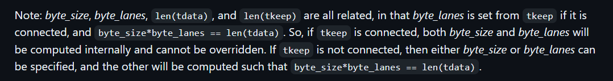

# Part 2 - AXI-stream images

In this second part of the series we are going to read image data from a file, stream it through our DUT and receive the data back in our test bench. Yes, we are doing AXI-streaming.

Starting with this chapter less actual code will be explained in detail as the reader is expected to study the test bench code themselves. New concepts as well as important pieces in the code will be highlighted.

What enables us to use AXI-streaming is [cocotbext-axi](https://github.com/alexforencich/cocotbext-axi), a python package containing AXI, AXI lite, and AXI stream modules for cocotb. In fact, cocotb and more specifically cocotb-bus are dependencies of this package. We will make use of 1x AXI-stream master (source) and 1x AXI-stream slave (sink) here. Later, Part 5 will also introduce the usage of 1x AXI-lite master to read and write IP registers.

| Tool    | Version |
| -------- | ------- |
| cocotbext-axi | 0.1.24 |

## Objectives

- send data via axi-stream master
- receive data via axi-stream slave
- read and write 8,10,12,16 bit RGB pnm images
- assert image data

## Step by step

| Source    | Description |
| -------- | ------- |
| axis_design.vhd | DUT |
| test_axis_design.py |  cocotb test bench file |
| test_runner.py |  Python runner  |
| AxiStreamImage.py |  Container class to represent an AXI-stream image |
| utility.py |  Helper file containing .pnm image r/w functions |
| images/ |  Folder containing RGB .pnm test images |
| waveoptions.gtkw |  pre-defined waveform option file. open with gtkwave |

### PNM images

First we need to have images that we can stream through the DUT. We’ll be using the .pnm image format. It can handle different bit widths, is uncompressed and human readable. For now we’ll consider 3 color component i.e. RGB images. In a later part of this series the pnm r/w utility functions will be improved to also handle grayscale i.e. RAW images.

Consider the following example 4x3 8-bit RGB image below. The header tells us the format (P3), the size (4x3) and the bit depth (255 → 8-bit). Afterwards every line represents an RGB value.

<details>
  <summary>RGBRandom_4x3_8bit.pnm</summary>

```
P3
4 3
255
115 156 146
168 77 187
129 56 89
235 45 50
132 29 45
46 247 89
199 22 219
196 208 169
101 189 2
180 90 67
231 154 224
168 40 79
```
</details>

To handle P3 .pnm images i asked the LLM (Large Language Model) of my choice (Grok) to create read and write functions for it. Polished them a bit and tested them. Have a look in utility.py. Note that the read function returns the pixel data, width, height and the max. value i.e. 
$$
2^{bit-depth}-1
$$

### AxiStreamImage

The next piece of the puzzle is our custom AXI-stream image container class, **AxiStreamImage**. Let me explain why we need it. cocotbext-axi provides us with a container for a generic AXI-stream data transfer called AxiStreamFrame. Don’t get confused by the naming here, a "frame" in AXI-stream terms is a single data transfer that ends with tlast=1 for the last data packet. When streaming a full image via AXI-stream the first pixel will be indicated by tuser[0]=1 and the last pixel of every line by tlast=1. Maybe you can already guess what **AxiStreamImage** does. That’s right, it keeps a list of AxiStreamFrame objects each of them representing 1 image line.

Consider RGBRandom_4x3_8bit.pnm from before. When we put the data into an **AxiStreamImage** it will look like this

|     |  |
| -------- | ------- |
| 0 | AxiStreamFrame [7576722, 11029947, 8468569, 15412530] |
| 1 | AxiStreamFrame [8658221, 3077977, 13047515, 12898473] |
| 2 | AxiStreamFrame [6667522, 11819587, 15178464, 11020367] |

Note that you don’t see the single R, G and B values but rather the combination of all of them making up a pixel. So for the first pixel this would be

$$
(115<<16) | (156<<8) | 146 = 7576722
$$

AxiStreamFrame already sets tlast=1 for the last data packet. We have to specify tuser[0]=1 for the first data packet inside **AxiStreamImage**. Have a look at AxiStreamImage.py now. Make sure to understand what’s going on.

In a later part of this series we will extend the capability of **AxiStreamImage** so that custom tuser payload data for bits 1..n can be specified too.

### DUT

AXI-stream slave and master signals are added to the DUT. They are directly connected so all data that streams into the DUT streams out of it without being changed. G_N_COLOR_COMPONENTS is added as a second generic.

Test bench

cocotbext-axi provides us with an AXI-stream master class (AxiStreamSource) and an AXI-stream slave class (AxiStreamSink). Before we can initialize them we have so set the size of the data transfer. In our case this will be `G_DATA_WIDTH` * `G_N_COLOR_COMPONENTS`. Note that even though the argument is called "byte_size" it does not have to be a byte aligned number. AXI-stream is simply recommended to be byte aligned.

```python
data_width = int(dut.G_DATA_WIDTH.value)
n_color_components = int(dut.G_N_COLOR_COMPONENTS.value)
byte_size = data_width * n_color_components
dut._log.info(f"NOTE: byte size will be set to G_N_COLOR_COMPONENTS*G_DATA_WIDTH = {n_color_components}*{data_width} = {byte_size}")
```

From the cocotbext-axi [README](https://github.com/alexforencich/cocotbext-axi/blob/master/README.md)

<p align="center">
	
</p>

When initializing `AxiStreamSource` and `AxiStreamSink` we can use `AxiStreamBus.from_prefix()` to identify and assign ports in the VHDL entity to either the source or the sink.

```python
axis_source = AxiStreamSource(AxiStreamBus.from_prefix(dut, "s_axis_video"), dut.clk, dut.reset_n, reset_active_level=False, byte_size=byte_size)
axis_sink = AxiStreamSink(AxiStreamBus.from_prefix(dut, "m_axis_video"), dut.clk, dut.reset_n, reset_active_level=False, byte_size=byte_size)
```

Sending and receiving data is done by the co-routines send() and recv() respectively. Receiving 1 frame i.e. line is done with `compact=False` to ensure that the tuser signal is kept as type <List> internally. Otherwise, since the tuser signal is always 0 except for the first pixel it would be compressed to an integer.

```python
rx_frame = await axis_sink.recv(compact=False)
```

The same image is send 3 times through the DUT. The test bench compares every received AxiStreamFrame i.e. line inside every AxiStreamImage against the original data. The received tuser signal is checked for the first tuser[0]=1. Lastly the received image is written to disk as a RGB .pnm in images/output.

### Python runner

The python runner is still the same from Part 1 except for the new generic G_N_COLOR_COMPONENTS that has been added.

After executing the python runner we can retrieve the waveform. Note how tuser and tlast signals behave for the 4x3 image transfer. tuser is high for the first pixel. tlast is high for every 4th pixel i.e. EOL. We have successfully transferred images via AXI-stream protocol


<p align="center">
	
</p>

For log level DEBUG and INFO the console output will contain the TX and RX AxiStreamFrame. Example for 1 image transfer below.

<details>
  <summary>output</summary>

```
0.00ns INFO     cocotb.axis_design.s_axis_video    AXI stream source
 0.00ns INFO     cocotb.axis_design.s_axis_video    cocotbext-axi version 0.1.24
 0.00ns INFO     cocotb.axis_design.s_axis_video    Copyright (c) 2020 Alex Forencich
 0.00ns INFO     cocotb.axis_design.s_axis_video    https://github.com/alexforencich/cocotbext-axi
 0.00ns INFO     cocotb.axis_design.s_axis_video    AXI stream source configuration:
 0.00ns INFO     cocotb.axis_design.s_axis_video      Byte size: 24 bits
 0.00ns INFO     cocotb.axis_design.s_axis_video      Data width: 24 bits (1 bytes)
 0.00ns INFO     cocotb.axis_design.s_axis_video    AXI stream source signals:
 0.00ns INFO     cocotb.axis_design.s_axis_video      tdata width: 24 bits
 0.00ns INFO     cocotb.axis_design.s_axis_video      tdest: not present
 0.00ns INFO     cocotb.axis_design.s_axis_video      tid: not present
 0.00ns INFO     cocotb.axis_design.s_axis_video      tkeep: not present
 0.00ns INFO     cocotb.axis_design.s_axis_video      tlast width: 1 bits
 0.00ns INFO     cocotb.axis_design.s_axis_video      tready width: 1 bits
 0.00ns INFO     cocotb.axis_design.s_axis_video      tuser width: 1 bits
 0.00ns INFO     cocotb.axis_design.s_axis_video      tvalid width: 1 bits
 0.00ns INFO     cocotb.axis_design.s_axis_video    Reset de-asserted
 0.00ns INFO     cocotb.axis_design.m_axis_video    AXI stream sink
 0.00ns INFO     cocotb.axis_design.m_axis_video    cocotbext-axi version 0.1.24
 0.00ns INFO     cocotb.axis_design.m_axis_video    Copyright (c) 2020 Alex Forencich
 0.00ns INFO     cocotb.axis_design.m_axis_video    https://github.com/alexforencich/cocotbext-axi
 0.00ns INFO     cocotb.axis_design.m_axis_video    AXI stream sink configuration:
 0.00ns INFO     cocotb.axis_design.m_axis_video      Byte size: 24 bits
 0.00ns INFO     cocotb.axis_design.m_axis_video      Data width: 24 bits (1 bytes)
 0.00ns INFO     cocotb.axis_design.m_axis_video    AXI stream sink signals:
 0.00ns INFO     cocotb.axis_design.m_axis_video      tdata width: 24 bits
 0.00ns INFO     cocotb.axis_design.m_axis_video      tdest: not present
 0.00ns INFO     cocotb.axis_design.m_axis_video      tid: not present
 0.00ns INFO     cocotb.axis_design.m_axis_video      tkeep: not present
 0.00ns INFO     cocotb.axis_design.m_axis_video      tlast width: 1 bits
 0.00ns INFO     cocotb.axis_design.m_axis_video      tready width: 1 bits
 0.00ns INFO     cocotb.axis_design.m_axis_video      tuser width: 1 bits
 0.00ns INFO     cocotb.axis_design.m_axis_video      tvalid width: 1 bits
 0.00ns INFO     cocotb.axis_design.m_axis_video    Reset de-asserted
20.00ns INFO     cocotb.axis_design.s_axis_video    TX frame: AxiStreamFrame(tdata=[7576722, 11029947, 8468569, 15412530], tkeep=None, tid=None, tdest=None, tuser=[1, 0, 0, 0], sim_time_start=20000000, sim_time_end=None)
40.00ns INFO     cocotb.axis_design.s_axis_video    TX frame: AxiStreamFrame(tdata=[8658221, 3077977, 13047515, 12898473], tkeep=None, tid=None, tdest=None, tuser=[0, 0, 0, 0], sim_time_start=40000000, sim_time_end=None)
40.00ns INFO     cocotb.axis_design.m_axis_video    RX frame: AxiStreamFrame(tdata=[7576722, 11029947, 8468569, 15412530], tkeep=[], tid=[], tdest=[], tuser=[1, 0, 0, 0], sim_time_start=25000000, sim_time_end=40000000)
60.00ns INFO     cocotb.axis_design.s_axis_video    TX frame: AxiStreamFrame(tdata=[6667522, 11819587, 15178464, 11020367], tkeep=None, tid=None, tdest=None, tuser=[0, 0, 0, 0], sim_time_start=60000000, sim_time_end=None)
60.00ns INFO     cocotb.axis_design.m_axis_video    RX frame: AxiStreamFrame(tdata=[8658221, 3077977, 13047515, 12898473], tkeep=[], tid=[], tdest=[], tuser=[0, 0, 0, 0], sim_time_start=45000000, sim_time_end=60000000)
80.00ns INFO     cocotb.axis_design.m_axis_video    RX frame: AxiStreamFrame(tdata=[6667522, 11819587, 15178464, 11020367], tkeep=[], tid=[], tdest=[], tuser=[0, 0, 0, 0], sim_time_start=65000000, sim_time_end=80000000)
80.00ns INFO     cocotb.regression                  axis_test_case passed
80.00ns INFO     cocotb.regression                  *****************************************************************************************
                                                    ** TEST                             STATUS  SIM TIME (ns)  REAL TIME (s)  RATIO (ns/s) **
                                                    *****************************************************************************************
                                                    ** test_axis_design.axis_test_case   PASS          80.00           0.01       7643.03  **
                                                    *****************************************************************************************
                                                    ** TESTS=1 PASS=1 FAIL=0 SKIP=0                    80.00           0.11        748.34  **
                                                    *****************************************************************************************
```
</details>

To reduce console output change the cocotb log level to something higher than INFO.

```python
# DEBUG=10, INFO=20, WARNING=30, ERROR=40, CRITICAL=50
dut._log.setLevel(logging.INFO)
```