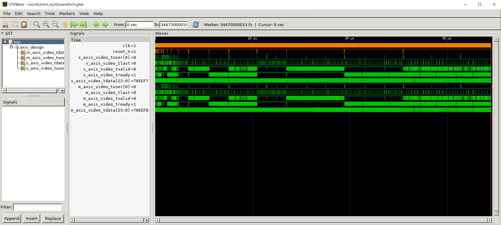
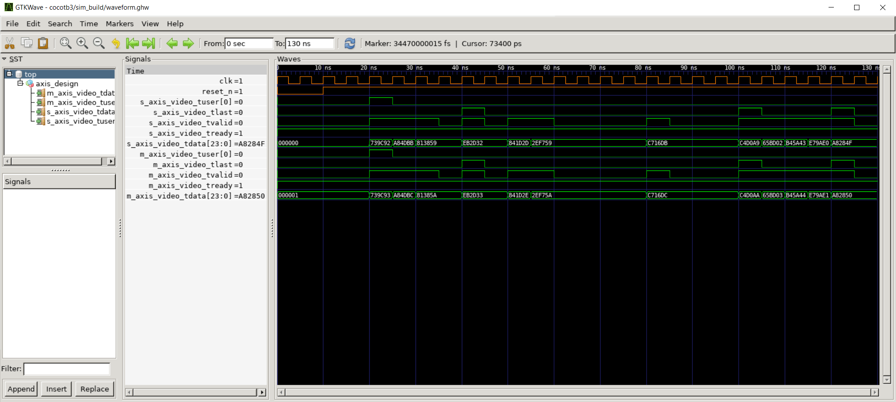

# Part 3 - More tests and simulation co-processing

In this third part of the series we are going to add more tests to our test bench. In the process we will learn how to selectively run test cases. The tests will be constructed from a combination of number of frames, image size and random handshake toggling. We’ll also implement a simulation co-processing meaning our cocotb python code will do the same operation as we’ll implement in the DUT. The results will be compared.

## Objectives

- multiple cocotb tests
  - number of frames
  - image size
  - random handshake toggling
- select test cases
- simulation co-processing
- test setup function
- environment variables

## Step by step

<div align="center">

| Source    | Description |
| -------- | ------- |
| axis_design.vhd | DUT |
| test_axis_design.py |  cocotb test bench file |
| test_runner.py |  Python runner  |
| AxiStreamImage.py |  Container class to represent an AXI-stream image |
| utility.py |  Helper file containing .pnm image r/w functions |
| images/ |  Folder containing RGB .pnm test images |
| waveoptions.gtkw |  pre-defined waveform option file. open with gtkwave |

</div>

AxiStreamImage.py is extended with a `from_frames()` constructor function to initialize AxiStreamImage from a list of AxiStreamFrames. More class function are added as well. Noteworthy `data(self)` which returns a concatenated 1D list of all pixel values from all AxiStreamFrames (i.e. lines) inside AxiStreamImage.

### DUT

The DUT is the same from part 2 of the series except that a +1 operation is being done to the input data vector before being assigned to the output port.

### Test bench

Lots of new stuff to unpack in the test bench. Multiple functions carry the cocotb.test() decorator now. From now on they are referred to as “test cases”. All test cases are necessary to test all combinations of number of frames, image size and random handshake toggling. Additionally one test case to check the DUT generics range has been added.


> [!NOTE]
> In cocotb 2.0, cocotb.parameterize() decorator can be used to generate named test combinations. 
> <br> This is already possible in 1.9.2 using [cocotb.regression.TestFactory](https://docs.cocotb.org/en/v1.9.2/library_reference.html#cocotb.regression.TestFactory) but all generated tests will have the same name with an increasing index number as postfix. [Testfactory will be deprecated in 2.0](https://docs.cocotb.org/en/latest/library_reference.html#cocotb.regression.TestFactory)


Almost all test cases call `axi_stream()` just with different parameters. Let’s have a look. 

General simulation setup has been moved into a `setup()` co-routine. From there we get the AxiStreamSource and AxiStreamSink objects to operate the image streaming. Note two parameters `idle_inserter` and `backpressure_inserter` that are passed to this function. Both are generators with `idle_inserter` being a generator for the AXI-stream tvalid source signal while `backpressure_inserter` is a generator for the AXI-stream tready sink signal.

```python
axis_source, axis_sink = await setup(dut, idle_inserter, backpressure_inserter)
```

The two generators originate in a function that implements a simple boolean toggling.


```python
def pause_generator():
    while True:
        yield bool(random.getrandbits(1))
```

When the simulation is run this will be evaluated every clock cycle to either toggle tvalid/tready or continue with the previous value. There are 4 possible combinations for the handshake toggling. Every combination has their own cocotb.test() function. It is always good practice to test all scenarios since we don’t know in what AXI-stream master/slave our DUT might be connected to in future usage.

<div align="center">

| tvalid    | tready |
| -------- | ------- |
| constant | constant |
| random | constant |
| constant | random |
| random | random |

</div>

Notice how easy it was to implement random handshake toggling on both the source and the sink and define test cases. This is in large due to cocotbext-axi supporting “pause generators” for all it’s AXI classes. We will make use of this functionality again in part 5 for an AXI-lite master.

> [!NOTE]
> The randomness is reproducable if `seed` is specified in the python runner

Continuing with the `axi_stream()` function we can see that it reads a .pnm image file and sends the data via AXI-stream source in `send()`. Note that the send and recv functionality have been separated into their own co-routines respectively. 

Before the data is received the function `coco()` is called with the input image data as argument. This is our simulation co-processing. Remember that the DUT in this part of the series is not a passthrough anymore. It does a +1 operation to the data. To be able to compare results from the test bench and the DUT the test bench needs to match that functionality. Note that the co-processing function is not a cocotb co-routine since it does not interact with the simulator, it is pure SW.

After receiving the data that has been streamed through the DUT in `recv()` we have two data sets to compare. Again we’re checking the tdata and the tuser signal both.

Optionally we can save the received frames to disk as RGB .pnm images. This option can be enabled in the python runner.

### Python runner

The python runner contains two small but very impactful changes compared to the last part of the series: 1x environment variable and 1x test case definition.

We use the environment variable `WRITE_IMAGE_OUTPUT` to decide if we want to save the output images to disk in images/output. This is useful when inspecting a single test case, which can be defined with the `testcase` argument. Note that this argument can also be a list of test cases.

> [!NOTE]
> In the next part of the series we will go into more depth on how to debug a design error.
> <br>At this point know this: selectively running test cases is extremely helpful.

First, let’s run all test cases by commenting out the testcase argument. The generic combination that is being executed then is the one defined in the `__main__` function. In this case 3 color components, 8-bit data width.

```python
# testcase=["run_axi_stream_1_frame_4x3_random_tvalid"]
```

```python
python test_runner.py
```

<details>
  <summary>output</summary>

```
....
     0.00ns INFO     cocotb.regression                  running run_axi_stream_1_frame_4x3 (1/17)
    85.00ns INFO     cocotb.regression                  run_axi_stream_1_frame_4x3 passed
    85.00ns INFO     cocotb.regression                  running run_axi_stream_1_frame_4x3_random_tvalid (2/17)
   215.00ns INFO     cocotb.regression                  run_axi_stream_1_frame_4x3_random_tvalid passed
   215.00ns INFO     cocotb.regression                  running run_axi_stream_1_frame_4x3_random_tready (3/17)
   370.00ns INFO     cocotb.regression                  run_axi_stream_1_frame_4x3_random_tready passed
   370.00ns INFO     cocotb.regression                  running run_axi_stream_1_frame_4x3_random_tvalid_random_tready (4/17)
   630.00ns INFO     cocotb.regression                  run_axi_stream_1_frame_4x3_random_tvalid_random_tready passed
   630.00ns INFO     cocotb.regression                  running run_axi_stream_3_frames_4x3 (5/17)
   845.00ns INFO     cocotb.regression                  run_axi_stream_3_frames_4x3 passed
   845.00ns INFO     cocotb.regression                  running run_axi_stream_3_frames_4x3_random_tvalid (6/17)
  1235.00ns INFO     cocotb.regression                  run_axi_stream_3_frames_4x3_random_tvalid passed
  1235.00ns INFO     cocotb.regression                  running run_axi_stream_3_frames_4x3_random_tready (7/17)
  1690.00ns INFO     cocotb.regression                  run_axi_stream_3_frames_4x3_random_tready passed
  1690.00ns INFO     cocotb.regression                  running run_axi_stream_3_frames_4x3_random_tvalid_random_tready (8/17)
  2380.00ns INFO     cocotb.regression                  run_axi_stream_3_frames_4x3_random_tvalid_random_tready passed
  2380.00ns INFO     cocotb.regression                  running run_axi_stream_1_frame_20x10 (9/17)
  3405.00ns INFO     cocotb.regression                  run_axi_stream_1_frame_20x10 passed
  3405.00ns INFO     cocotb.regression                  running run_axi_stream_1_frame_20x10_random_tvalid (10/17)
  5525.00ns INFO     cocotb.regression                  run_axi_stream_1_frame_20x10_random_tvalid passed
  5525.00ns INFO     cocotb.regression                  running run_axi_stream_1_frame_20x10_random_tready (11/17)
  7560.00ns INFO     cocotb.regression                  run_axi_stream_1_frame_20x10_random_tready passed
  7560.00ns INFO     cocotb.regression                  running run_axi_stream_1_frame_20x10_random_tvalid_random_tready (12/17)
 10435.00ns INFO     cocotb.regression                  run_axi_stream_1_frame_20x10_random_tvalid_random_tready passed
 10435.00ns INFO     cocotb.regression                  running run_axi_stream_3_frames_20x10 (13/17)
 13470.00ns INFO     cocotb.regression                  run_axi_stream_3_frames_20x10 passed
 13470.00ns INFO     cocotb.regression                  running run_axi_stream_3_frames_20x10_random_tvalid (14/17)
 19395.00ns INFO     cocotb.regression                  run_axi_stream_3_frames_20x10_random_tvalid passed
 19395.00ns INFO     cocotb.regression                  running run_axi_stream_3_frames_20x10_random_tready (15/17)
 25450.00ns INFO     cocotb.regression                  run_axi_stream_3_frames_20x10_random_tready passed
 25450.00ns INFO     cocotb.regression                  running run_axi_stream_3_frames_20x10_random_tvalid_random_tready (16/17)
 34475.00ns INFO     cocotb.regression                  run_axi_stream_3_frames_20x10_random_tvalid_random_tready passed
 34475.00ns INFO     cocotb.regression                  running generics_range (17/17)
 34475.00ns INFO     cocotb.regression                  generics_range passed
 34475.00ns INFO     cocotb.regression                  ************************************************************************************************************************************
                                                        ** TEST                                                                        STATUS  SIM TIME (ns)  REAL TIME (s)  RATIO (ns/s) **
                                                        ************************************************************************************************************************************
                                                        ** test_axis_design.run_axi_stream_1_frame_4x3                                  PASS          85.00           0.01      11290.72  **
                                                        ** test_axis_design.run_axi_stream_1_frame_4x3_random_tvalid                    PASS         130.00           0.01      15119.64  **
                                                        ** test_axis_design.run_axi_stream_1_frame_4x3_random_tready                    PASS         155.00           0.01      15536.32  **
                                                        ** test_axis_design.run_axi_stream_1_frame_4x3_random_tvalid_random_tready      PASS         260.00           0.02      16341.77  **
                                                        ** test_axis_design.run_axi_stream_3_frames_4x3                                 PASS         215.00           0.01      15299.11  **
                                                        ** test_axis_design.run_axi_stream_3_frames_4x3_random_tvalid                   PASS         390.00           0.02      16631.71  **
                                                        ** test_axis_design.run_axi_stream_3_frames_4x3_random_tready                   PASS         455.00           0.03      17165.03  **
                                                        ** test_axis_design.run_axi_stream_3_frames_4x3_random_tvalid_random_tready     PASS         690.00           0.04      17352.72  **
                                                        ** test_axis_design.run_axi_stream_1_frame_20x10                                PASS        1025.00           0.06      16900.22  **
                                                        ** test_axis_design.run_axi_stream_1_frame_20x10_random_tvalid                  PASS        2120.00           0.12      18261.20  **
                                                        ** test_axis_design.run_axi_stream_1_frame_20x10_random_tready                  PASS        2035.00           0.12      17271.90  **
                                                        ** test_axis_design.run_axi_stream_1_frame_20x10_random_tvalid_random_tready    PASS        2875.00           0.16      17533.21  **
                                                        ** test_axis_design.run_axi_stream_3_frames_20x10                               PASS        3035.00           0.18      17211.66  **
                                                        ** test_axis_design.run_axi_stream_3_frames_20x10_random_tvalid                 PASS        5925.00           0.33      18161.92  **
                                                        ** test_axis_design.run_axi_stream_3_frames_20x10_random_tready                 PASS        6055.00           0.33      18443.80  **
                                                        ** test_axis_design.run_axi_stream_3_frames_20x10_random_tvalid_random_tready   PASS        9025.00           0.50      17997.53  **
                                                        ** test_axis_design.generics_range                                              PASS           0.00           0.00          0.01  **
                                                        ************************************************************************************************************************************
                                                        ** TESTS=17 PASS=17 FAIL=0 SKIP=0                                                          34475.00           2.04      16921.36  **
                                                        ************************************************************************************************************************************
```
</details>

As we can see all test cases pass as expected because our test bench implements the same operation as the DUT. Note that the console output is minimal, since the log level is set to WARNING. In the waveform viewer we can see that all signal changes over all test cases were captured.

<p align="center">
	
</p>

Now let’s run only test case `run_axi_stream_1_frame_4x3_random_tvalid` 

```python
testcase=["run_axi_stream_1_frame_4x3_random_tvalid"]
```

```python
python test_runner.py
```

<details>
  <summary>output</summary>

```
....
     0.00ns INFO     cocotb.regression                  running run_axi_stream_1_frame_4x3_random_tvalid (1/1)
   130.00ns INFO     cocotb.regression                  run_axi_stream_1_frame_4x3_random_tvalid passed
   130.00ns INFO     cocotb.regression                  *******************************************************************************************************************
                                                        ** TEST                                                       STATUS  SIM TIME (ns)  REAL TIME (s)  RATIO (ns/s) **
                                                        *******************************************************************************************************************
                                                        ** test_axis_design.run_axi_stream_1_frame_4x3_random_tvalid   PASS         130.00           0.01      12858.07  **
                                                        *******************************************************************************************************************
                                                        ** TESTS=1 PASS=1 FAIL=0 SKIP=0                                             130.00           0.10       1283.25  **
                                                        *******************************************************************************************************************
```
</details>

The random tvalid source signal toggling can be seen on `s_axis_video_tvalid`. The tready sink signal `m_axis_video_tready` is constantly high, as expected.

<p align="center">
	
</p>


> [!NOTE]
> cocotb is often (rightfully so) criticized for being slow since it has to go back and forth between simulator and python every clock cycle. 
> 
> For you to know, simulating 1 test case for 1 1024x768 8-bit image (const. tvalid, const tready) took me 226 seconds and required ~3.4 GB RAM
> 
> During development, it is advisable to use smaller image sizes. This is why you'll see this series use examples like 4x3, 20x10, etc.