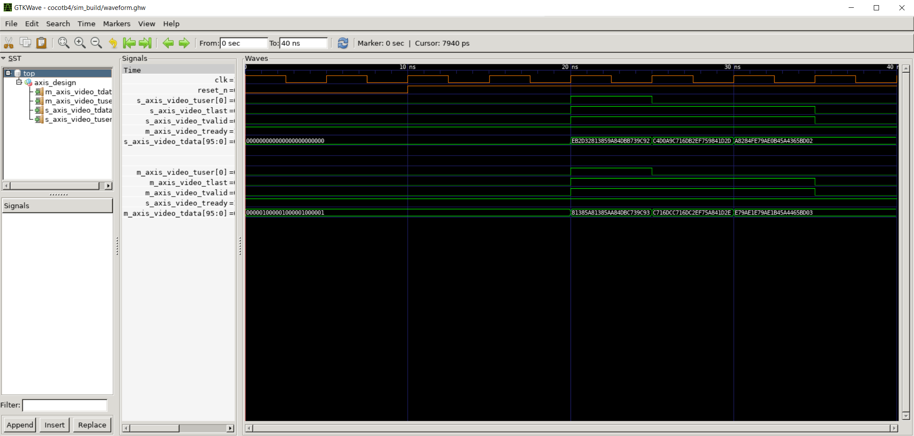
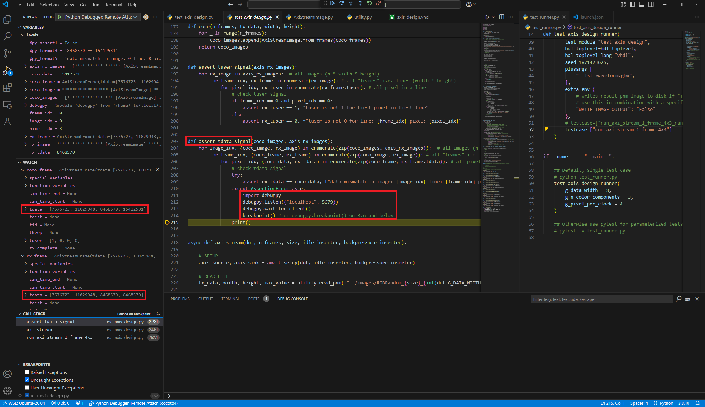

# Part 4 - Debugging a design error

In this fourth part of the series we are going to look at an actual real world use case, a design that contains a bug. Starting from our parameterized tests, continuing through our test cases and ending up in singular tests we will find the error, fix it and make sure that all our tests pass afterwards. There will be more total tests combinations run in this part than in all previous ones combined since we’re adding 2 and 4 PPC support to our test bench and DUT.

## Objectives

- 2 and 4 PPC support
- assert with pixel level accuracy
- attach Python debugger (VS code)
- debug error in design

## Step by step

<div align="center">

| Source    | Description |
| -------- | ------- |
| axis_design.vhd | DUT |
| test_axis_design.py |  cocotb test bench file |
| test_runner.py |  Python runner  |
| AxiStreamImage.py |  Container class to represent an AXI-stream image |
| utility.py |  Helper file containing .pnm image r/w functions |
| images/ |  Folder containing RGB .pnm test images |
| waveoptions.gtkw |  pre-defined waveform option file. open with gtkwave |
| .vscode/launch.json |  Python remote debugger settings |

</div>

The one file that is new in this part is the launch.json config file containing Python debugger settings. We will use it to attach a remote Python debugger later.

Note: The Python debugger is "remote" for my setup since i'm working in WSL2 on a windows 10 host. There are certainly other possibilities to attach a debugger

### DUT

The DUT is extended with 2 and 4 PPC functionality. The generic `G_PIXEL_PER_CLOCK` is added.

### Test bench

2 and 4 PPC support is added to the test bench. This includes `send()` and `recv()` functions. >1 PPC data is always concatenated right before send, and sliced again right after receive. All other parts of the test bench: image read, co-simulation, image write and asserts operate on 1 PPC data.

The following table shows the packing for >1 PPC data. Pixel 0 is always put into the LSBs of any data vector, pixel 1 into the next bits and so on and so forth. Take a minute to study the `send()` and `recv()` functions. There is a lot of bit shifting going on to put the pixel values into the correct place and to retrieve them.

<div align="center">

<table>
  <tr>
    <th>Pixel</th>
    <th>Index</th>
    <th>RGB</th>
  </tr>
  <tr>
    <td rowspan="3">3</td>
    <td>2</td>
    <td>R</td>
  </tr>
  <tr>
    <td>1</td>
    <td>G</td>
  </tr>
  <tr>
    <td>0</td>
    <td>B</td>
  </tr>
  <tr>
    <td rowspan="3">2</td>
    <td>2</td>
    <td>R</td>
  </tr>
  <tr>
    <td>1</td>
    <td>G</td>
  </tr>
  <tr>
    <td>0</td>
    <td>B</td>
  </tr>
  <tr>
    <td rowspan="3">1</td>
    <td>2</td>
    <td>R</td>
  </tr>
  <tr>
    <td>1</td>
    <td>G</td>
  </tr>
  <tr>
    <td>0</td>
    <td>B</td>
  </tr>
   <tr>
    <td rowspan="3">0</td>
    <td>2</td>
    <td>R</td>
  </tr>
  <tr>
    <td>1</td>
    <td>G</td>
  </tr>
  <tr>
    <td>0</td>
    <td>B</td>
  </tr>
  
</table>


</div>

The byte_size that is being configured for AxiStreamSource and AxiStreamSink is extended by a multiplication with PPC too now.

```python
# Generics
data_width = int(dut.G_DATA_WIDTH.value)
n_color_components = int(dut.G_N_COLOR_COMPONENTS.value)
pixel_per_clock = int(dut.G_PIXEL_PER_CLOCK.value)
#
byte_size = pixel_per_clock*n_color_components*data_width
dut._log.info(f"NOTE: byte size will be set to G_PIXEL_PER_CLOCK*G_N_COLOR_COMPONENTS*G_DATA_WIDTH = {pixel_per_clock}*{n_color_components}*{data_width} = {byte_size}")
```

One more thing that is added to the test bench in this chapter is pixel level accuracy for asserts. But what does that mean? Consider the assert function from the previous part

<details>
  <summary>part 3 - assert_tdata_signal()</summary>

```python
def assert_tdata_signal(coco_images, axis_rx_images):
    for image_idx, (coco_image, rx_image) in enumerate(zip(coco_images, axis_rx_images)):  # all images (n * width * height)
        for frame_idx, (coco_frame, rx_frame) in enumerate(zip(coco_image, rx_image)): # all "frames" i.e. lines (width * height)
            # check tdata signal
            assert list(rx_frame.tdata) == coco_frame.tdata, f"data mismatch in image: {image_idx} line: {frame_idx}"
```
</details>

and compare it to the new version

<details>
  <summary>part 4 - assert_tdata_signal()</summary>

```python
def assert_tdata_signal(coco_images, axis_rx_images):
    for image_idx, (coco_image, rx_image) in enumerate(zip(coco_images, axis_rx_images)):  # all images (n * width * height)
        for frame_idx, (coco_frame, rx_frame) in enumerate(zip(coco_image, rx_image)): # all "frames" i.e. lines (width * height)
            for pixel_idx, (coco_data, rx_tdata) in enumerate(zip(coco_frame, rx_frame.tdata)): # all pixel in a line
                # check tdata signal
                assert rx_tdata == coco_data, f"data mismatch in image: {image_idx} line: {frame_idx} pixel: {pixel_idx}"
```
</details>

The data is compared on pixel level now instead of on line level before. This allows us to locate any mismatches we might have between the DUT and the simulation co-processing results more accurately. The same is done for the tuser assert function.

### Python runner

The generic `G_PIXEL_PER_CLOCK` is added as a parameter with the new possible values 2 and 4.

Let’s run all our tests. We have 12 combinations of generics that we are testing with 17 tests each. This amounts to a total of 204 tests.

```cmd
pytest -v python_runner.py
```

<details>
  <summary>output</summary>

```
===================================================== short test summary info =============================================================================
FAILED test_runner.py::test_axis_design_runner[ G_PIXEL_PER_CLOCK=4 - G_N_COLOR_COMPONENTS=3 - G_DATA_WIDTH=8 ] - SystemExit: ERROR: Failed 16 of 17 tests.
FAILED test_runner.py::test_axis_design_runner[ G_PIXEL_PER_CLOCK=4 - G_N_COLOR_COMPONENTS=3 - G_DATA_WIDTH=10 ] - SystemExit: ERROR: Failed 16 of 17 tests.
FAILED test_runner.py::test_axis_design_runner[ G_PIXEL_PER_CLOCK=4 - G_N_COLOR_COMPONENTS=3 - G_DATA_WIDTH=12 ] - SystemExit: ERROR: Failed 16 of 17 tests.
FAILED test_runner.py::test_axis_design_runner[ G_PIXEL_PER_CLOCK=4 - G_N_COLOR_COMPONENTS=3 - G_DATA_WIDTH=16 ] - SystemExit: ERROR: Failed 16 of 17 tests.
============================================== 4 failed, 8 passed, 1 warning in 19.81s ====================================================================
```
</details>

On pytest level, 4 failed and 8 passed. When this happens we should look at what the failing tests have in common. In this case it’s all the 4 PPC tests. Let’s specify one of those in the python test runner

```python
if __name__ == "__main__":
  test_axis_design_runner(
      g_data_width = 8,
      g_n_color_components = 3,
      g_pixel_per_clock = 4      # set to 4 PPC !
  )
```

and run it

```cmd
python test_runner.py
```

<details>
  <summary>output</summary>

```
....
     0.00ns INFO     cocotb.regression                  running run_axi_stream_1_frame_4x3 (1/17)
    40.00ns INFO     cocotb.regression                  run_axi_stream_1_frame_4x3 failed
                                                        Traceback (most recent call last):
                                                          File "/home/mto/cocotb4/test_axis_design.py", line 255, in run_axi_stream_1_frame_4x3
                                                            await axi_stream(dut, 1, "4x3", None, None)
                                                          File "/home/mto/cocotb4/test_axis_design.py", line 237, in axi_stream
                                                            assert_tdata_signal(coco_images, axis_rx_images)
                                                          File "/home/mto/cocotb4/test_axis_design.py", line 208, in assert_tdata_signal
                                                            assert rx_tdata == coco_data, f"data mismatch in image: {image_idx} line: {frame_idx} pixel: {pixel_idx}"
                                                        AssertionError: data mismatch in image: 0 line: 0 pixel: 3
                                                        assert 8468570 == 15412531
    40.00ns INFO     cocotb.regression                  running run_axi_stream_1_frame_4x3_random_tvalid (2/17)
    80.00ns INFO     cocotb.regression                  run_axi_stream_1_frame_4x3_random_tvalid failed
                                                        Traceback (most recent call last):
                                                          File "/home/mto/cocotb4/test_axis_design.py", line 259, in run_axi_stream_1_frame_4x3_random_tvalid
                                                            await axi_stream(dut, 1, "4x3", pause_generator(), None)
                                                          File "/home/mto/cocotb4/test_axis_design.py", line 237, in axi_stream
                                                            assert_tdata_signal(coco_images, axis_rx_images)
                                                          File "/home/mto/cocotb4/test_axis_design.py", line 208, in assert_tdata_signal
                                                            assert rx_tdata == coco_data, f"data mismatch in image: {image_idx} line: {frame_idx} pixel: {pixel_idx}"
                                                        AssertionError: data mismatch in image: 0 line: 0 pixel: 3
                                                        assert 8468570 == 15412531
    80.00ns INFO     cocotb.regression                  running run_axi_stream_1_frame_4x3_random_tready (3/17)
   125.00ns INFO     cocotb.regression                  run_axi_stream_1_frame_4x3_random_tready failed
                                                        Traceback (most recent call last):
                                                          File "/home/mto/cocotb4/test_axis_design.py", line 263, in run_axi_stream_1_frame_4x3_random_tready
                                                            await axi_stream(dut, 1, "4x3", None, pause_generator())
                                                          File "/home/mto/cocotb4/test_axis_design.py", line 237, in axi_stream
                                                            assert_tdata_signal(coco_images, axis_rx_images)
                                                          File "/home/mto/cocotb4/test_axis_design.py", line 208, in assert_tdata_signal
                                                            assert rx_tdata == coco_data, f"data mismatch in image: {image_idx} line: {frame_idx} pixel: {pixel_idx}"
                                                        AssertionError: data mismatch in image: 0 line: 0 pixel: 3
                                                        assert 8468570 == 15412531
   125.00ns INFO     cocotb.regression                  running run_axi_stream_1_frame_4x3_random_tvalid_random_tready (4/17)
   210.00ns INFO     cocotb.regression                  run_axi_stream_1_frame_4x3_random_tvalid_random_tready failed
                                                        Traceback (most recent call last):
                                                          File "/home/mto/cocotb4/test_axis_design.py", line 267, in run_axi_stream_1_frame_4x3_random_tvalid_random_tready
                                                            await axi_stream(dut, 1, "4x3", pause_generator(), pause_generator())
                                                          File "/home/mto/cocotb4/test_axis_design.py", line 237, in axi_stream
                                                            assert_tdata_signal(coco_images, axis_rx_images)
                                                          File "/home/mto/cocotb4/test_axis_design.py", line 208, in assert_tdata_signal
                                                            assert rx_tdata == coco_data, f"data mismatch in image: {image_idx} line: {frame_idx} pixel: {pixel_idx}"
                                                        AssertionError: data mismatch in image: 0 line: 0 pixel: 3
                                                        assert 8468570 == 15412531
   210.00ns INFO     cocotb.regression                  running run_axi_stream_3_frames_4x3 (5/17)
   300.00ns INFO     cocotb.regression                  run_axi_stream_3_frames_4x3 failed
                                                        Traceback (most recent call last):
                                                          File "/home/mto/cocotb4/test_axis_design.py", line 271, in run_axi_stream_3_frames_4x3
                                                            await axi_stream(dut, 3, "4x3", None, None)
                                                          File "/home/mto/cocotb4/test_axis_design.py", line 237, in axi_stream
                                                            assert_tdata_signal(coco_images, axis_rx_images)
                                                          File "/home/mto/cocotb4/test_axis_design.py", line 208, in assert_tdata_signal
                                                            assert rx_tdata == coco_data, f"data mismatch in image: {image_idx} line: {frame_idx} pixel: {pixel_idx}"
                                                        AssertionError: data mismatch in image: 0 line: 0 pixel: 3
                                                        assert 8468570 == 15412531
   300.00ns INFO     cocotb.regression                  running run_axi_stream_3_frames_4x3_random_tvalid (6/17)
   455.00ns INFO     cocotb.regression                  run_axi_stream_3_frames_4x3_random_tvalid failed
                                                        Traceback (most recent call last):
                                                          File "/home/mto/cocotb4/test_axis_design.py", line 275, in run_axi_stream_3_frames_4x3_random_tvalid
                                                            await axi_stream(dut, 3, "4x3", pause_generator(), None)
                                                          File "/home/mto/cocotb4/test_axis_design.py", line 237, in axi_stream
                                                            assert_tdata_signal(coco_images, axis_rx_images)
                                                          File "/home/mto/cocotb4/test_axis_design.py", line 208, in assert_tdata_signal
                                                            assert rx_tdata == coco_data, f"data mismatch in image: {image_idx} line: {frame_idx} pixel: {pixel_idx}"
                                                        AssertionError: data mismatch in image: 0 line: 0 pixel: 3
                                                        assert 8468570 == 15412531
   455.00ns INFO     cocotb.regression                  running run_axi_stream_3_frames_4x3_random_tready (7/17)
   625.00ns INFO     cocotb.regression                  run_axi_stream_3_frames_4x3_random_tready failed
                                                        Traceback (most recent call last):
                                                          File "/home/mto/cocotb4/test_axis_design.py", line 279, in run_axi_stream_3_frames_4x3_random_tready
                                                            await axi_stream(dut, 3, "4x3", None, pause_generator())
                                                          File "/home/mto/cocotb4/test_axis_design.py", line 237, in axi_stream
                                                            assert_tdata_signal(coco_images, axis_rx_images)
                                                          File "/home/mto/cocotb4/test_axis_design.py", line 208, in assert_tdata_signal
                                                            assert rx_tdata == coco_data, f"data mismatch in image: {image_idx} line: {frame_idx} pixel: {pixel_idx}"
                                                        AssertionError: data mismatch in image: 0 line: 0 pixel: 3
                                                        assert 8468570 == 15412531
   625.00ns INFO     cocotb.regression                  running run_axi_stream_3_frames_4x3_random_tvalid_random_tready (8/17)
   855.00ns INFO     cocotb.regression                  run_axi_stream_3_frames_4x3_random_tvalid_random_tready failed
                                                        Traceback (most recent call last):
                                                          File "/home/mto/cocotb4/test_axis_design.py", line 283, in run_axi_stream_3_frames_4x3_random_tvalid_random_tready
                                                            await axi_stream(dut, 3, "4x3", pause_generator(), pause_generator())
                                                          File "/home/mto/cocotb4/test_axis_design.py", line 237, in axi_stream
                                                            assert_tdata_signal(coco_images, axis_rx_images)
                                                          File "/home/mto/cocotb4/test_axis_design.py", line 208, in assert_tdata_signal
                                                            assert rx_tdata == coco_data, f"data mismatch in image: {image_idx} line: {frame_idx} pixel: {pixel_idx}"
                                                        AssertionError: data mismatch in image: 0 line: 0 pixel: 3
                                                        assert 8468570 == 15412531
   855.00ns INFO     cocotb.regression                  running run_axi_stream_1_frame_20x10 (9/17)
  1130.00ns INFO     cocotb.regression                  run_axi_stream_1_frame_20x10 failed
                                                        Traceback (most recent call last):
                                                          File "/home/mto/cocotb4/test_axis_design.py", line 287, in run_axi_stream_1_frame_20x10
                                                            await axi_stream(dut, 1, "20x10", None, None)
                                                          File "/home/mto/cocotb4/test_axis_design.py", line 237, in axi_stream
                                                            assert_tdata_signal(coco_images, axis_rx_images)
                                                          File "/home/mto/cocotb4/test_axis_design.py", line 208, in assert_tdata_signal
                                                            assert rx_tdata == coco_data, f"data mismatch in image: {image_idx} line: {frame_idx} pixel: {pixel_idx}"
                                                        AssertionError: data mismatch in image: 0 line: 0 pixel: 3
                                                        assert 9471282 == 12597037
  1130.00ns INFO     cocotb.regression                  running run_axi_stream_1_frame_20x10_random_tvalid (10/17)
  1800.00ns INFO     cocotb.regression                  run_axi_stream_1_frame_20x10_random_tvalid failed
                                                        Traceback (most recent call last):
                                                          File "/home/mto/cocotb4/test_axis_design.py", line 291, in run_axi_stream_1_frame_20x10_random_tvalid
                                                            await axi_stream(dut, 1, "20x10", pause_generator(), None)
                                                          File "/home/mto/cocotb4/test_axis_design.py", line 237, in axi_stream
                                                            assert_tdata_signal(coco_images, axis_rx_images)
                                                          File "/home/mto/cocotb4/test_axis_design.py", line 208, in assert_tdata_signal
                                                            assert rx_tdata == coco_data, f"data mismatch in image: {image_idx} line: {frame_idx} pixel: {pixel_idx}"
                                                        AssertionError: data mismatch in image: 0 line: 0 pixel: 3
                                                        assert 9471282 == 12597037
  1800.00ns INFO     cocotb.regression                  running run_axi_stream_1_frame_20x10_random_tready (11/17)
  2310.00ns INFO     cocotb.regression                  run_axi_stream_1_frame_20x10_random_tready failed
                                                        Traceback (most recent call last):
                                                          File "/home/mto/cocotb4/test_axis_design.py", line 295, in run_axi_stream_1_frame_20x10_random_tready
                                                            await axi_stream(dut, 1, "20x10", None, pause_generator())
                                                          File "/home/mto/cocotb4/test_axis_design.py", line 237, in axi_stream
                                                            assert_tdata_signal(coco_images, axis_rx_images)
                                                          File "/home/mto/cocotb4/test_axis_design.py", line 208, in assert_tdata_signal
                                                            assert rx_tdata == coco_data, f"data mismatch in image: {image_idx} line: {frame_idx} pixel: {pixel_idx}"
                                                        AssertionError: data mismatch in image: 0 line: 0 pixel: 3
                                                        assert 9471282 == 12597037
  2310.00ns INFO     cocotb.regression                  running run_axi_stream_1_frame_20x10_random_tvalid_random_tready (12/17)
  3115.00ns INFO     cocotb.regression                  run_axi_stream_1_frame_20x10_random_tvalid_random_tready failed
                                                        Traceback (most recent call last):
                                                          File "/home/mto/cocotb4/test_axis_design.py", line 299, in run_axi_stream_1_frame_20x10_random_tvalid_random_tready
                                                            await axi_stream(dut, 1, "20x10", pause_generator(), pause_generator())
                                                          File "/home/mto/cocotb4/test_axis_design.py", line 237, in axi_stream
                                                            assert_tdata_signal(coco_images, axis_rx_images)
                                                          File "/home/mto/cocotb4/test_axis_design.py", line 208, in assert_tdata_signal
                                                            assert rx_tdata == coco_data, f"data mismatch in image: {image_idx} line: {frame_idx} pixel: {pixel_idx}"
                                                        AssertionError: data mismatch in image: 0 line: 0 pixel: 3
                                                        assert 9471282 == 12597037
  3115.00ns INFO     cocotb.regression                  running run_axi_stream_3_frames_20x10 (13/17)
  3910.00ns INFO     cocotb.regression                  run_axi_stream_3_frames_20x10 failed
                                                        Traceback (most recent call last):
                                                          File "/home/mto/cocotb4/test_axis_design.py", line 303, in run_axi_stream_3_frames_20x10
                                                            await axi_stream(dut, 3, "20x10", None, None)
                                                          File "/home/mto/cocotb4/test_axis_design.py", line 237, in axi_stream
                                                            assert_tdata_signal(coco_images, axis_rx_images)
                                                          File "/home/mto/cocotb4/test_axis_design.py", line 208, in assert_tdata_signal
                                                            assert rx_tdata == coco_data, f"data mismatch in image: {image_idx} line: {frame_idx} pixel: {pixel_idx}"
                                                        AssertionError: data mismatch in image: 0 line: 0 pixel: 3
                                                        assert 9471282 == 12597037
  3910.00ns INFO     cocotb.regression                  running run_axi_stream_3_frames_20x10_random_tvalid (14/17)
  5455.00ns INFO     cocotb.regression                  run_axi_stream_3_frames_20x10_random_tvalid failed
                                                        Traceback (most recent call last):
                                                          File "/home/mto/cocotb4/test_axis_design.py", line 307, in run_axi_stream_3_frames_20x10_random_tvalid
                                                            await axi_stream(dut, 3, "20x10", pause_generator(), None)
                                                          File "/home/mto/cocotb4/test_axis_design.py", line 237, in axi_stream
                                                            assert_tdata_signal(coco_images, axis_rx_images)
                                                          File "/home/mto/cocotb4/test_axis_design.py", line 208, in assert_tdata_signal
                                                            assert rx_tdata == coco_data, f"data mismatch in image: {image_idx} line: {frame_idx} pixel: {pixel_idx}"
                                                        AssertionError: data mismatch in image: 0 line: 0 pixel: 3
                                                        assert 9471282 == 12597037
  5455.00ns INFO     cocotb.regression                  running run_axi_stream_3_frames_20x10_random_tready (15/17)
  7030.00ns INFO     cocotb.regression                  run_axi_stream_3_frames_20x10_random_tready failed
                                                        Traceback (most recent call last):
                                                          File "/home/mto/cocotb4/test_axis_design.py", line 311, in run_axi_stream_3_frames_20x10_random_tready
                                                            await axi_stream(dut, 3, "20x10", None, pause_generator())
                                                          File "/home/mto/cocotb4/test_axis_design.py", line 237, in axi_stream
                                                            assert_tdata_signal(coco_images, axis_rx_images)
                                                          File "/home/mto/cocotb4/test_axis_design.py", line 208, in assert_tdata_signal
                                                            assert rx_tdata == coco_data, f"data mismatch in image: {image_idx} line: {frame_idx} pixel: {pixel_idx}"
                                                        AssertionError: data mismatch in image: 0 line: 0 pixel: 3
                                                        assert 9471282 == 12597037
  7030.00ns INFO     cocotb.regression                  running run_axi_stream_3_frames_20x10_random_tvalid_random_tready (16/17)
  9265.00ns INFO     cocotb.regression                  run_axi_stream_3_frames_20x10_random_tvalid_random_tready failed
                                                        Traceback (most recent call last):
                                                          File "/home/mto/cocotb4/test_axis_design.py", line 315, in run_axi_stream_3_frames_20x10_random_tvalid_random_tready
                                                            await axi_stream(dut, 3, "20x10", pause_generator(), pause_generator())
                                                          File "/home/mto/cocotb4/test_axis_design.py", line 237, in axi_stream
                                                            assert_tdata_signal(coco_images, axis_rx_images)
                                                          File "/home/mto/cocotb4/test_axis_design.py", line 208, in assert_tdata_signal
                                                            assert rx_tdata == coco_data, f"data mismatch in image: {image_idx} line: {frame_idx} pixel: {pixel_idx}"
                                                        AssertionError: data mismatch in image: 0 line: 0 pixel: 3
                                                        assert 9471282 == 12597037
  9265.00ns INFO     cocotb.regression                  running generics_range (17/17)
  9265.00ns INFO     cocotb.regression                  generics_range passed
  9265.00ns INFO     cocotb.regression                  ************************************************************************************************************************************
                                                        ** TEST                                                                        STATUS  SIM TIME (ns)  REAL TIME (s)  RATIO (ns/s) **
                                                        ************************************************************************************************************************************
                                                        ** test_axis_design.run_axi_stream_1_frame_4x3                                  FAIL          40.00           0.01       7051.92  **
                                                        ** test_axis_design.run_axi_stream_1_frame_4x3_random_tvalid                    FAIL          40.00           0.00       9595.75  **
                                                        ** test_axis_design.run_axi_stream_1_frame_4x3_random_tready                    FAIL          45.00           0.00      10157.34  **
                                                        ** test_axis_design.run_axi_stream_1_frame_4x3_random_tvalid_random_tready      FAIL          85.00           0.01      12616.46  **
                                                        ** test_axis_design.run_axi_stream_3_frames_4x3                                 FAIL          90.00           0.01      12003.92  **
                                                        ** test_axis_design.run_axi_stream_3_frames_4x3_random_tvalid                   FAIL         155.00           0.01      14042.32  **
                                                        ** test_axis_design.run_axi_stream_3_frames_4x3_random_tready                   FAIL         170.00           0.01      14280.05  **
                                                        ** test_axis_design.run_axi_stream_3_frames_4x3_random_tvalid_random_tready     FAIL         230.00           0.02      14859.21  **
                                                        ** test_axis_design.run_axi_stream_1_frame_20x10                                FAIL         275.00           0.02      12663.27  **
                                                        ** test_axis_design.run_axi_stream_1_frame_20x10_random_tvalid                  FAIL         670.00           0.04      16292.15  **
                                                        ** test_axis_design.run_axi_stream_1_frame_20x10_random_tready                  FAIL         510.00           0.03      15320.84  **
                                                        ** test_axis_design.run_axi_stream_1_frame_20x10_random_tvalid_random_tready    FAIL         805.00           0.05      15822.44  **
                                                        ** test_axis_design.run_axi_stream_3_frames_20x10                               FAIL         795.00           0.06      13618.32  **
                                                        ** test_axis_design.run_axi_stream_3_frames_20x10_random_tvalid                 FAIL        1545.00           0.10      15899.95  **
                                                        ** test_axis_design.run_axi_stream_3_frames_20x10_random_tready                 FAIL        1575.00           0.10      15058.36  **
                                                        ** test_axis_design.run_axi_stream_3_frames_20x10_random_tvalid_random_tready   FAIL        2235.00           0.14      15911.16  **
                                                        ** test_axis_design.generics_range                                              PASS           0.00           0.00          0.01  **
                                                        ************************************************************************************************************************************
                                                        ** TESTS=17 PASS=1 FAIL=16 SKIP=0                                                           9265.00           0.72      12909.32  **
                                                        ************************************************************************************************************************************
```
</details>

As we can see actually all AXI-stream test cases fail. There must be something seriously wrong. We can already see the assertion errors for individual test cases on the console all pointing to the 4th pixel in the very first 4-pixel-packet.

> AssertionError: data mismatch in image: 0 line: 0 pixel: 3

Since all test cases are failing let’s isolate a simple test case so we can look at the waveform.

```python
testcase=["run_axi_stream_1_frame_4x3"]
```

Run again

```cmd
python test_runner.py
```

<details>
  <summary>output</summary>

```
....
   0.00ns INFO     cocotb.regression                  running run_axi_stream_1_frame_4x3 (1/1)
  40.00ns INFO     cocotb.regression                  run_axi_stream_1_frame_4x3 failed
                                                      Traceback (most recent call last):
                                                        File "/home/mto/cocotb4/test_axis_design.py", line 255, in run_axi_stream_1_frame_4x3
                                                          await axi_stream(dut, 1, "4x3", None, None)
                                                        File "/home/mto/cocotb4/test_axis_design.py", line 237, in axi_stream
                                                          assert_tdata_signal(coco_images, axis_rx_images)
                                                        File "/home/mto/cocotb4/test_axis_design.py", line 208, in assert_tdata_signal
                                                          assert rx_tdata == coco_data, f"data mismatch in image: {image_idx} line: {frame_idx} pixel: {pixel_idx}"
                                                      AssertionError: data mismatch in image: 0 line: 0 pixel: 3
                                                      assert 8468570 == 15412531
  40.00ns INFO     cocotb.regression                  *****************************************************************************************************
                                                      ** TEST                                         STATUS  SIM TIME (ns)  REAL TIME (s)  RATIO (ns/s) **
                                                      *****************************************************************************************************
                                                      ** test_axis_design.run_axi_stream_1_frame_4x3   FAIL          40.00           0.01       7124.99  **
                                                      *****************************************************************************************************
                                                      ** TESTS=1 PASS=0 FAIL=1 SKIP=0                                40.00           0.10        418.28  **
                                                      *****************************************************************************************************
```
</details>

Waveform

<p align="center">
	
</p>

Two things about the test we just ran 

1. the data depth is 4 PPC * 3 color components * 8-bit which results in a 96-bit vector. 

2. the image size is 4x3 at 4 PPC. This means that 1 image line is transferred in 1 clock cycle.

At least there is nothing wrong with the AXI-stream control signals tuser, tlast, tvalid, tready. We'll if we're being honest we already kind of assumed that because the test bench did reach the tdata assert function so the AXI-stream transfer must have happened. However it is good to confirm this.

Let's debug into the test bench code. To do this we are going to attach a remote python debugger in VS code.

1. Install debugpy

```cmd
pip install debugpy
```

2. create .vscode/launch.json 

<details>
  <summary>launch.json</summary>

```
{
    "version": "0.2.0",
    "configurations": [

        {
            "name": "Python Debugger: Remote Attach",
            "type": "debugpy",
            "request": "attach",
            "connect": {
                "host": "localhost",
                "port": 5679
            },
            "pathMappings": [
                {
                    "localRoot": "${workspaceFolder}",
                    "remoteRoot": "."
                }
            ]
        }
    ]
}
```
</details>

3. add the following debug code in test bench to act as breakpoint 

```python
import debugpy
debugpy.listen(("localhost", 5679))
debugpy.wait_for_client()
breakpoint() # or debugpy.breakpoint() on 3.6 and below
```

4. run the test bench (it’ll wait for a debugger to attach)

```cmd
python test_runner.py
```

5. Attach a debugger: left pane → debug → run (breakpoint should trigger then)

For reference see [Setting Up a Dev Environment in Visual Studio Code](https://hardwareteams.com/docs/fpga-asic/cocotb/cocotb-dev/2-setting-up-dev/)

Remember, the data we’ll be looking at in the tdata assert function is 1 PPC! Just the send and recv parts of are 4 PPC. So the pixel values we are comparing here are single pixel RGB values.

<p align="center">
	
</p>

Let's analyze the 4 pixel values for the first line more closely. As we can see the 4th value differs significantly as we saw in the console output earlier already. In fact the 4th pixel value in rx_frame is exactly the same as the 3rd pixel value in rx_frame. 

<div align="center">

| coco_frame    | rx_frame |
| -------- | ------- |
| 7576723 | 7576723 |
| 11029948 | 11029948 |
| 8468570 | 8468570 |
| 15412531 | 8468570 |

</div>

It is very suspicious that in the rx_frame the 3rd and 4th pixel have the same value. At this point we should assume that there is an issue in the DUT code. Let’s have a look. The part of the code that is responsible for the 4 PPC processing is this one

```vhdl
ppc_4 : if G_PIXEL_PER_CLOCK = 4 generate
  m_axis_video_tdata(1*C_PIXEL_WIDTH-1 downto 0*C_PIXEL_WIDTH) <= std_logic_vector(unsigned(s_axis_video_tdata(1*C_PIXEL_WIDTH-1 downto 0*C_PIXEL_WIDTH)) + 1);
  m_axis_video_tdata(2*C_PIXEL_WIDTH-1 downto 1*C_PIXEL_WIDTH) <= std_logic_vector(unsigned(s_axis_video_tdata(2*C_PIXEL_WIDTH-1 downto 1*C_PIXEL_WIDTH)) + 1);
  m_axis_video_tdata(3*C_PIXEL_WIDTH-1 downto 2*C_PIXEL_WIDTH) <= std_logic_vector(unsigned(s_axis_video_tdata(3*C_PIXEL_WIDTH-1 downto 2*C_PIXEL_WIDTH)) + 1);
  m_axis_video_tdata(4*C_PIXEL_WIDTH-1 downto 3*C_PIXEL_WIDTH) <= std_logic_vector(unsigned(s_axis_video_tdata(3*C_PIXEL_WIDTH-1 downto 2*C_PIXEL_WIDTH)) + 1);
end generate;
```

If we look at the fourth line of the `m_axis_video_tdata` assignment we see the error. It may have been just a copy&paste mistake but an error nonetheless. To fix it we will simply correct the two incorrect indices.

```vhdl
m_axis_video_tdata(4*C_PIXEL_WIDTH-1 downto 3*C_PIXEL_WIDTH) <= std_logic_vector(unsigned(s_axis_video_tdata(4*C_PIXEL_WIDTH-1 downto 3*C_PIXEL_WIDTH)) + 1);
```

Now, comment out the single test case again in the python runner and run all test cases in all parameterized combinations with pytest.

```cmd
pytest -v test_runner.py
```

<details>
  <summary>output</summary>

```
============================================= warnings summary =======================================================================
test_runner.py:4
  /home/mto/cocotb4/test_runner.py:4: UserWarning: Python runners and associated APIs are an experimental feature and subject to change.
    from cocotb.runner import get_runner

-- Docs: https://docs.pytest.org/en/stable/how-to/capture-warnings.html
====================================== 12 passed, 1 warning in 19.44s ================================================================
```
</details>

Looks like the issue has been fixed. Good job!

