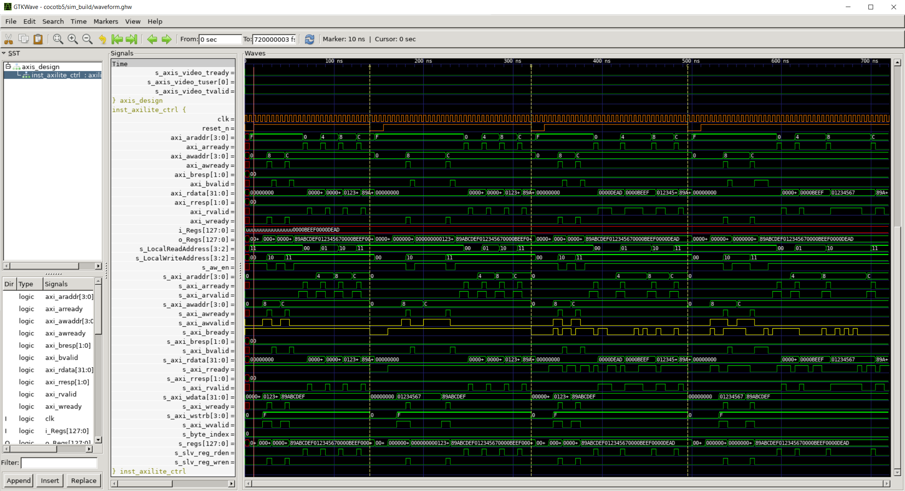

# Part 5 - AXI-lite register access

In this fifth part of the series we will implement an AXI-lite interface to read and write DUT registers. The DUT will be extended with an AXI-lite slave while an AXI-lite master will be added to the test bench. With that we will add new tests for random handshake toggling for our new interface. We’ll also learn more about simulator arguments and how we can include VHDL 2008 sources into the build process and access package resources. Improving the test bench code further, we will add specialized test setup functions which enable us to quickly implement new test cases.

## Objectives

- AXI-lite interface read/write
- more tests (random handshake toggling)
- VHDL 2008 sources (packages)
- specialized test setup functions

## Step by step

<div align="center">

| Source    | Description |
| -------- | ------- |
| axis_design.vhd | DUT |
| test_axis_design.py |  cocotb test bench file |
| test_runner.py |  Python runner  |
| AxiStreamImage.py |  Container class to represent an AXI-stream image |
| utility.py |  Helper file containing .pnm image r/w functions |
| images/ |  Folder containing RGB .pnm test images |
| waveoptions.gtkw |  pre-defined waveform option file. open with gtkwave |
| .vscode/launch.json |  Python remote debugger settings |
| axilite_ctrl.vhd |  AXI-lite slave implementation |
| axis_design_package.vhd |  package file containing constants |

</div>

### DUT

An AXI-lite slave and a package file are added. Lots of new code added in axis_design.vhd as well but don’t worry, most of it is boilerplate. Note the I/O ports added to the entity declaration for all AXI-lite signals.

**axi_lite_ctrl.vhd** is the AXI-lite slave adapted from a Xilinx template. Two features were added on top of it: 

1. Define the exact number of 32-bit registers
2. Selectively chose read and write, or read-only for each register

This chapter will not go into detail of how AXI-lite and specifically this AXI-lite slave works. Take it as given.

**axis_design_package.vhd** contains some AXI-lite constants. They are used in axis_design.vhd. We define 4x 32-bit registers. Register 0 and 1 shall be read-only while register 2 and 3 shall be r/w.

The read-only values are defined in axis_design.vhd

```vhdl
-------------------------------------------------------------------------------------------
-- Read only registers
-------------------------------------------------------------------------------------------
s_InputControlRegister(1*C_PKG_S_AXI_CTRL_DATA_WIDTH-1 downto 0*C_PKG_S_AXI_CTRL_DATA_WIDTH) <= std_logic_vector(to_unsigned(16#DEAD#, C_PKG_S_AXI_CTRL_DATA_WIDTH));
s_InputControlRegister(2*C_PKG_S_AXI_CTRL_DATA_WIDTH-1 downto 1*C_PKG_S_AXI_CTRL_DATA_WIDTH) <= std_logic_vector(to_unsigned(16#BEEF#, C_PKG_S_AXI_CTRL_DATA_WIDTH));
```

<div align="center">

| Register    | Value |
| -------- | ------- |
| 0 | 0xDEAD |
| 1 | 0xBEEF |

</div>

### Test bench

The test bench is extended with the **AxiLiteMaster** class from cocotbext-axi. It supports random handshake toggling via pause-generators just like AxiStreamSource and AxiStreamSink do. By default AxiLiteMaster assumes a 32-bit data word which is perfect since our AXI-lite slave inside our DUT is a 32-bit implementation.

We already had the general AXI-stream function `axi_stream()` that all AXI-stream test cases were calling before. Now we’re adding the general `axi_lite()` function for all AXI-lite test cases with the same intention.

Additionally the setup functions will be split into more distinct parts. `setup_axis()`, `setup_axilite()` and `setup_sim()`. Take a minute to look through those functions and where they’re called from.

Just as we did in part 3 of this series, we’re going to add test cases for all 4 possible combinations of random tvalid/tready toggling.

> [!NOTE]
> As already mentioned in part 3 of the series, in cocotb 2.0 cocotb.parameterize() decorator can be used to generate these named test combinations.

```python
@cocotb.test()
async def run_axi_lite(dut):
    await axi_lite(dut, None, None)

@cocotb.test()
async def run_axi_lite_random_tvalid(dut):
    await axi_lite(dut, pause_generator(), None)

@cocotb.test()
async def run_axi_lite_random_tready(dut):
    await axi_lite(dut, None, pause_generator())

@cocotb.test()
async def run_axi_lite_random_tvalid_random_tready(dut):
    await axi_lite(dut, pause_generator(), pause_generator())
```

Since we have 2 read-only and 2 r/w registers we’ll test the former against expected values and the latter by writing and reading back values. Additionally we’ll print all register values to the console in debug mode. Notice how the AxiLiteMaster `read()` and `write()` function are cocotb co-routines themselves.

We add one additional test to check the axi_lite_ctrl generics against expected values. 

> [!NOTE]
> Accessing DUT package constants directly is not possible in cocotb with GHDL >simulator since it uses VPI, not VHPI. <br>see https://github.com/ghdl/ghdl/issues/1648
> 
> However values can be accessed on the signals, constants…etc. where they’re used. 
> 
> In the future it may be possible to access package constants. <br>see https://github.com/cocotb/cocotb/issues/1833
 

```python
@cocotb.test()
async def run_axi_lite_generics_sanity(dut):
  G_S_AXI_CTRL_NUMBER_OF_REGISTERS = dut.inst_axilite_ctrl.G_S_AXI_CTRL_NUMBER_OF_REGISTERS.value.integer

  G_S_AXI_CTRL_DATA_WIDTH = dut.inst_axilite_ctrl.G_S_AXI_CTRL_DATA_WIDTH.value.integer
  assert G_S_AXI_CTRL_DATA_WIDTH == 32

  G_S_AXI_CTRL_ADDR_WIDTH = dut.inst_axilite_ctrl.G_S_AXI_CTRL_ADDR_WIDTH.value.integer
  assert G_S_AXI_CTRL_ADDR_WIDTH == (math.ceil(math.log2(G_S_AXI_CTRL_NUMBER_OF_REGISTERS)) + 2)

  # NOTE: unfortunately "complex" generic types like std_logic_vector cannot be accessed
  # print(dut.inst_axilite_ctrl.G_S_AXI_CTRL_WRITE_REGISTER)
```

There is one minor drawback. Unfortunately “complex“ generic types like std_logic_vector cannot be accessed at all.

### Python runner

The main change in the python runner is that we'll compile our VHDL source files with GHDL with the VHDL 2008 standard. To do that we need to specify build and test arguments. see https://docs.cocotb.org/en/stable/library_reference.html#cocotb.runner.Simulator

For GHDL the build arguments are appended to ghdl -i and -m while the test arguments are appended to ghdl -r. See the snippet from the console output below. It is important to set this for both the compile and the run stage because otherwise it will fail. The same applies to other [GHDL command line options](http://ghdl.free.fr/ghdl/GHDL-options.html)

```python
runner.build(
    ...
    build_args = [
        "--std=08",
    ],
    ...
)

runner.test(
    ...
    test_args = [
        "--std=08"
    ],
    ...
)
```

<details>
  <summary>output</summary>

```
INFO: Running command ghdl -i --work=top --std=08 /home/mto/cocotb5/axilite_ctrl.vhd /home/mto/cocotb5/axis_design_package.vhd /home/mto/cocotb5/axis_design.vhd in directory /home/mto/cocotb5/sim_build
INFO: Running command ghdl -m --work=top --std=08 axis_design in directory /home/mto/cocotb5/sim_build
INFO: Running command ghdl -r --work=top --std=08 axis_design --vpi=/home/mto/.local/lib/python3.8/site-packages/cocotb/libs/libcocotbvpi_ghdl.so --fst=waveform.ghw -gG_DATA_WIDTH=8 -gG_N_COLOR_COMPONENTS=3 -gG_PIXEL_PER_CLOCK=1 in d
...
```
</details>

The second most significant change in the python runner is that we're going through the directory to collect all .vhd source files since we have multiple now. If you payed really close attention you may have noticed that the tag has changed from `sources` to `vhdl_sources` now. In our case it doesn't matter which one we use but for mixed-language DUTs containing VHDL and Verilog sources, the `sources` must be used.

```python
runner.build(
    vhdl_sources = glob.glob(f"{proj_path}/*.vhd"),
    ...
)
```

Oh yeah and one more change is that we’re building from scratch every time.

```python
runner.build(
    ...
    clean = True # build fresh
)
```

Running our new test cases by defining them in the testcase argument we can see that they pass successfully.


```python
python test_runner.py
```

<details>
  <summary>output</summary>

```
...
140.00ns INFO     cocotb.regression                  run_axi_lite passed
140.00ns INFO     cocotb.regression                  running run_axi_lite_random_tvalid (2/4)
320.00ns INFO     cocotb.regression                  run_axi_lite_random_tvalid passed
320.00ns INFO     cocotb.regression                  running run_axi_lite_random_tready (3/4)
495.00ns INFO     cocotb.regression                  run_axi_lite_random_tready passed
495.00ns INFO     cocotb.regression                  running run_axi_lite_random_tvalid_random_tready (4/4)
720.00ns INFO     cocotb.regression                  run_axi_lite_random_tvalid_random_tready passed
720.00ns INFO     cocotb.regression                  *******************************************************************************************************************
                                                    ** TEST                                                       STATUS  SIM TIME (ns)  REAL TIME (s)  RATIO (ns/s) **
                                                    *******************************************************************************************************************
                                                    ** test_axis_design.run_axi_lite                               PASS         140.00           0.02       8863.57  **
                                                    ** test_axis_design.run_axi_lite_random_tvalid                 PASS         180.00           0.01      13547.01  **
                                                    ** test_axis_design.run_axi_lite_random_tready                 PASS         175.00           0.01      11863.64  **
                                                    ** test_axis_design.run_axi_lite_random_tvalid_random_tready   PASS         225.00           0.02      11845.04  **
                                                    *******************************************************************************************************************
                                                    ** TESTS=4 PASS=4 FAIL=0 SKIP=0                                             720.00           0.16       4623.23  **
                                                    *******************************************************************************************************************
```
</details>

In the waveform we can see 4 test cases being executed. They are separated by the vertical yellow lines. The yellow signals that are highlighted show the random tvalid/tready combinations we expect. Note that there are fewer AXI-lite writes than reads being executed since there are only 2 write registers while all 4 registers are being read from.

<p align="center">
	
</p>